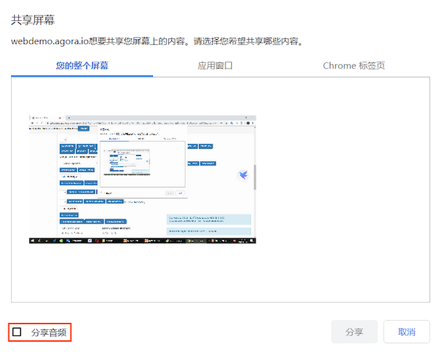
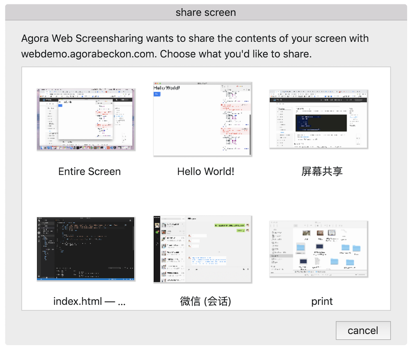
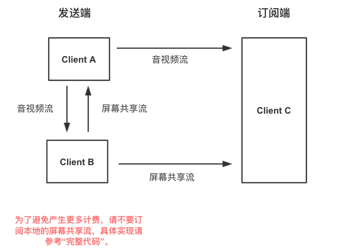

## 功能简介
在视频通话或互动直播中进行屏幕共享，可以将说话人或主播的屏幕内容，以视频画面的方式分享给其他说话人或观众观看，以提高沟通效率。

屏幕共享在如下场景中应用广泛：
- 视频会议场景中，屏幕共享可以将讲话者本地的文件、数据、网页、PPT 等画面分享给其他与会人；
- 在线课堂场景中，屏幕共享可以将老师的课件、笔记、讲课内容等画面展示给学生观看。

在开始前，请确保已在你的项目中实现基本的实时音视频功能。详见 [实现音视频通话](basic_call.md)。

## 工作原理

Web 端屏幕共享，实际上是通过创建一个屏幕共享的视频轨道对象来实现的。SDK 提供了 [createScreenVideoTrack](/api/cn/interfaces/iagorartc.html#createscreenvideotrack) 方法来让开发者通过屏幕共享来创建一个本地的视频轨道对象。采集屏幕共享的过程中浏览器会询问需要共享哪些屏幕，根据用户的选择去获取屏幕信息。


> 对于同一个用户，Agora 只支持同时发布最多一个视频轨道，如果在发布屏幕共享的同时，还想要发布本地摄像头视频，则需要两个用户来实现。你可以创建两个 AgoraRTCClient 对象，分别加入同一个频道，一路发送屏幕共享流，一路发送视频流。

## Chrome 屏幕共享

### 无插件屏幕共享

在 Chrome 上屏幕共享直接调用 [createScreenVideoTrack](/api/cn/interfaces/iagorartc.html#createscreenvideotrack) 即可

> 该功能要求 Chrome 72 或以上版本。如果你使用的软件版本不满足此要求，请使用屏幕共享插件实现在 Chrome 上共享屏幕。

```js
AgoraRTC.createScreenVideoTrack({
  // 可以在这里配置编码参数，详细参考 API 文档
  encoderConfig: "1080p_1",
}).then(localScreenTrack => {
  /** ... **/
});
```

### 使用屏幕共享插件
安装 Agora 提供的 [Chrome 屏幕共享插件](https://docs.agora.io/cn/Interactive%20Broadcast/chrome_screensharing_plugin) ，并获取插件的 extensionId，在建流的时候填入 extensionId。

```js
AgoraRTC.createScreenTrack({
  extensionId: 'minllpmhdgpndnkomcoccfekfegnlikg',
}).then(localScreenTrack => {
  /** ... **/
});

```

### 分享音频
Agora Web SDK NG 支持在 Windows 平台的 Chrome 浏览器 74 及以上版本同时共享屏幕和本地播放的背景音，使用时，将 [createScreenVideoTrack](/api/cn/interfaces/iagorartc.html#createscreenvideotrack) 方法的第二个参数设置为 `true` 即可。

> 此时该方法会返回一个列表，列表分别是屏幕共享的视频轨道对象和本地播放背景音的音频轨道对象。

```js
AgoraRTC.createScreenVideoTrack({
  encoderConfig: "1080p_1",
}, true).then([screenVideoTrack, screenAudioTrack] => {
  /** ... **/
});
```

> - 使用这个方法后，还需要在屏幕共享的弹出框上勾选**分享音频**才能真正生效。
> - 如果选择共享单个应用窗口无法使用分享音频功能。



## Electron 屏幕共享
Electron 屏幕共享的选择界面需要你自行绘制，为方便快速集成，我们提供一个默认的选择界面。

### 默认界面
如果你选择使用默认界面，在 Electron 下使用屏幕共享和 Web 下的操作则没有区别。直接调用 [createScreenVideoTrack](/api/cn/interfaces/iagorartc.html#createscreenvideotrack) 即可。

```js
AgoraRTC.createScreenVideoTrack({
  encoderConfig: "1080p_1",
}).then(localScreenTrack => {
  /** ... **/
});
```

调用后SDK 会提供自带的默认界面让用户选择要共享的屏幕或窗口，如下图所示：



### 自定义界面
如果你需要自定义选择界面，参考以下步骤：
1. 调用 SDK 提供的 AgoraRTC.getElectronScreenSources 方法获取可共享的屏幕信息。
```
AgoraRTC.getElectronScreenSources().then(sources => {
  console.log(sources);
})
```
`sources` 是一个 `source` 对象的列表，`source` 里包含了分享源的信息和 `sourceId`，`source` 的属性如下：


- id： 即 sourceId
- name：屏幕源的名字
- thumbnail：屏幕源的快照

2. 根据 `source` 的属性，（用 html 和 css）绘制选择界面，让用户选择要共享的屏幕源。`source` 的属性与屏幕共享的选择界面对应关系如下：


3. 获取用户选择的 `sourceId`。
4. 调用  [createScreenVideoTrack](/api/cn/interfaces/iagorartc.html#createscreenvideotrack) 时将 `sourceId` 填入 `electronScreenSourceId`，就能创建相应的屏幕共享流了。

``` javascript
AgoraRTC.createScreenVideoTrack({
  // 填入用户选择的 sourceId
  electronScreenSourceId： sourceId,
}).then(localScreenTrack => {
  /** ... **/
});
```

> - getElectronScreenSources 方法是对 Electron 提供的 desktopCapturer.getSources 进行的封装，详情可参考 [desktopCapturer](https://electronjs.org/docs/api/desktop-capturer)。
> - 在非 Electron 下传入 sourceId 会被忽略。

## Firefox 屏幕共享

Firefox 屏幕共享需要通过设置 `screenSourceType` 指定分享屏幕的类型，`screenSourceType` 的选择如下：
- `screen`：分享整个显示器屏幕
- `application`：分享某个应用的所有窗口
- `window`：分享某个应用的某个窗口

```js
AgoraRTC.createScreenVideoTrack({
  screenSourceType: 'screen' // 'screen', 'application', 'window'
}).then(localScreenTrack => { /** ... **/ });
```
> Firefox 在 Windows 平台不支持 application 模式。

## 同时共享屏幕和开启视频
因为每个 AgoraRTCClient 对象只能发送一路视频轨，所以如果要在一个发送端同时分享屏幕和开启视频，需要创建两个 AgoraRTCClient，一路发送屏幕共享轨，一路发送摄像头轨。

```js
async function startScreenCall() {
  const screenClient = AgoraRTC.createClient({ mode: "rtc", codec: "vp8" });
  await screenClient.join("<TOKEN>", "<CHANNEL>");

  const screenTrack = await AgoraRTC.createScreenVideoTrack();
  await screenClient.publish(screenTrack);

  return screenClient;
}

async function startVideoCall() {
  const videoClient = AgoraRTC.createClient({ mode: "rtc", codec: "vp8" });
  await videoClient.join("<TOKEN>", "<CHANNEL>");

  const videoTrack = await AgoraRTC.createCameraVideoTrack();
  await videoClient.publish(videoTrack);

  return videoClient;
}

Promise.all([startScreenCall(), startVideoCall()]).then(() => { /** ... **/ });
```
自己订阅自己，会产生额外的计费，如图：



Agora 建议，为避免重复计费，每个 Client 成功加入频道以后，把返回的 uid 存在列表里。每次监听到 `user-published` 事件的时候，先判断加入的流是否是本地流，如果是，则不订阅。

## 开发注意事项

- 同一个用户同时只能发布一路视频轨道
- 负责发布屏幕共享的用户的 UID 不要固定在同一个值，否则某些场景下同 UID 的共享流可能会引起互踢。
- 在屏幕共享的时候，本地流的 Client **不要订阅本地的屏幕共享流**，否则会增加计费。
- 在 Windows 平台上进行屏幕共享时，如果共享的是 QQ 聊天窗口会导致黑屏。